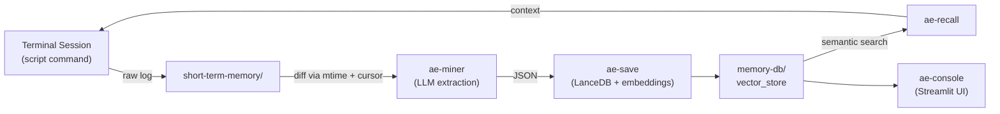

[English](./README.md)

# Agentic Engram

**AIコーディングエージェントのための自律型ローカルメモリエコシステム -- 人間の記憶の仕組みにインスパイアされた設計。**

Agentic Engramは、開発セッションの生ログを記録し、LLMで再利用可能なナレッジを抽出し、ローカルのベクトルDBに保存する。エージェントはセマンティック検索で過去の教訓を呼び出せる -- クラウド不要、Docker不要、常駐サーバー不要。

## コンセプト



**ライフサイクル:**

1. **記録** -- `script`コマンドがターミナルI/Oを`~/.engram/short-term-memory/`にストリーミングする。
2. **採掘** -- `ae-miner`（cron）が`mtime`+行ポインタカーソルで変更ログを検出し、差分をLLMに送信。LLMがINSERT / UPDATE / SKIPを判定する。
3. **保存** -- `ae-save`が`sentence-transformers`でペイロードを埋め込みベクトル化し、LanceDBにupsertする。
4. **想起** -- `ae-recall`がコサイン類似度検索を実行。エージェントは未知のエラーに遭遇した際に自律的に呼び出す。
5. **管理** -- `ae-console`がStreamlitダッシュボードを提供し、メモリの閲覧・検索・削除ができる。

## 機能

- 完全ローカル、ゼロオーバーヘッド -- ファイルシステムベース、外部APIやサーバー不要
- Filebeatスタイルのクラッシュ耐性 -- `mtime`+行ポインタのみで状態管理、ステータスフラグなし
- 決定論的ID（SHA-256）による冪等upsert
- LanceDB + `paraphrase-multilingual-MiniLM-L12-v2`（384次元）によるセマンティック検索
- カテゴリ・タグフィルタリング
- TTLベースの古いログの自動アーカイブ
- Streamlit管理コンソール
- グラフDB拡張ポイント（`entities_json`、`relations_json`）をV2向けに予約済み

## クイックスタート

### 要件

- Python 3.9+
- LLMプロバイダ（OpenAI、Anthropicなど）：`ae-save`、`ae-recall`、`ae-console`には**不要**。`ae-miner`はログ抽出にLLMを使用する設計だが、CLIレベルの統合はまだ未実装。

### インストール

```bash
pip install -e ".[dev]"
```

### セッションの記録

```bash
script -q -a ~/.engram/short-term-memory/session_$(date +%Y%m%d_%H%M%S)_log.txt
```

### メモリの手動保存

```bash
echo '[{"action":"INSERT","payload":{"event":"CORS error with Ollama","context":"Direct fetch from Next.js client","core_lessons":"Use Route Handler as proxy","category":"architecture","tags":["Next.js","CORS"],"related_files":["app/api/chat/route.ts"],"session_id":"session_001"}}]' \
  | python scripts/ae-save.py
```

### メモリの検索

```bash
python scripts/ae-recall.py --query "CORS error" --format markdown
python scripts/ae-recall.py --query "CORS error" --format json --limit 3
```

### マイナーの実行

```bash
python scripts/ae-miner.py --dry-run                # 対象ログファイルをプレビュー（LLM不要）
python scripts/ae-miner.py --llm claude-code         # Claude CodeをLLMバックエンドとして使用
python scripts/ae-miner.py --llm codex               # Codex CLIを使用
python scripts/ae-miner.py --llm gemini              # Gemini CLIを使用
```

### コンソールの起動

```bash
streamlit run scripts/ae-console.py
```

## アーキテクチャ

```
~/.engram/
  short-term-memory/     生セッションログ（短期記憶）
    archive/             TTL期限切れログ
  memory-db/
    vector_store/        LanceDBデータ（セマンティック検索）
    graph_store/         [V2] Kuzuデータ（論理ネットワーク）
  config/
    cursor.json          ログファイルごとの行ポインタ + mtime
```

| コンポーネント | ファイル | 役割 |
|-----------|------|------|
| `db` | `src/engram/db.py` | LanceDB接続、スキーマ、CRUD |
| `save` | `src/engram/save.py` | バリデーション、ID生成、upsertロジック |
| `recall` | `src/engram/recall.py` | セマンティック検索、出力フォーマット |
| `miner` | `src/engram/miner.py` | ログスキャン、差分読み取り、LLMオーケストレーション、アーカイブ |
| `cursor` | `src/engram/cursor.py` | cursor.jsonのアトミックな状態管理 |
| `prompts` | `src/engram/prompts.py` | 抽出用LLMプロンプト構築 |
| `embedder` | `src/engram/embedder.py` | sentence-transformersのシングルトンラッパー |
| `console` | `src/engram/console.py` | Streamlit UIロジック（統計、閲覧、削除） |

## CLIリファレンス

### ae-save

stdinからJSON配列を読み取り、バリデーション・埋め込み・LanceDBへのupsertを行う。

```
python scripts/ae-save.py [--db-path PATH]
```

### ae-recall

セマンティック類似度でメモリを検索する。

```
python scripts/ae-recall.py --query "..." [--format json|markdown] [--limit N] [--category CAT]
```

### ae-miner

セッションログをスキャンし、LLMでナレッジを抽出し、メモリDBに保存する。

```
python scripts/ae-miner.py --llm claude-code|codex|gemini
                           [--log-dir DIR] [--db-path PATH] [--cursor-path PATH]
                           [--archive-dir DIR] [--ttl-days N] [--dry-run]
```

### ae-console

メモリ管理用のStreamlit Webダッシュボード。

```
streamlit run scripts/ae-console.py
```

## AIエージェントとの連携

### エージェント1（開発エージェント） -- 自律的な想起

#### CLAUDE.mdにae-recallをスキルとして登録する

プロジェクトの`CLAUDE.md`（またはグローバルアクセス用に`~/.claude/CLAUDE.md`）に以下を追加する：

```markdown
# Skills

## Memory Recall
When you encounter an unfamiliar error, unexpected behavior, or need to check
if a similar problem was solved before, run:
  python /path/to/agentic-engram/scripts/ae-recall.py --query "<describe the issue>" --format markdown --limit 3
Review the results before attempting a fix from scratch.
```

エージェントは未知のエラーに遭遇した際に自律的に`ae-recall`を呼び出し、ゼロから解決を試みる前に過去の教訓を取得する。

#### 開発セッションの自動記録

シェルエイリアスを追加し、すべての`claude`セッションを透過的に記録する：

```bash
# ~/.bashrc or ~/.zshrc
alias ae-claude='script -q -a ~/.engram/short-term-memory/session_$(date +%Y%m%d_%H%M%S)_log.txt -c "claude"'
```

`claude`の代わりに`ae-claude`を実行するだけで、すべてのターミナルI/Oがオーバーヘッドなしで`short-term-memory/`にストリーミングされる。

### エージェント2（マイナー） -- AIコーディングエージェントCLIの利用

`ae-miner`はAIコーディングエージェントCLI（Claude Code、Codex CLI、Gemini CLI）をLLMバックエンドとして使用する。別途APIキーを設定する必要はなく、すでに認証済みのCLIツールに処理を委譲する。

```bash
python scripts/ae-miner.py --llm claude-code   # `claude -p` を使用
python scripts/ae-miner.py --llm codex          # `codex -q` を使用
python scripts/ae-miner.py --llm gemini         # `gemini` を使用
```

#### PythonでカスタムLLMを渡す

CLIツールを使わずAPIを直接呼び出す場合は、`process_log()`にカスタム`llm_fn`コールバックを渡す：

```python
from engram.cursor import CursorManager
from engram.miner import scan_logs, process_log
import os

cm = CursorManager(os.path.expanduser("~/.engram/config/cursor.json"))

# -- OpenAIの例 --
from openai import OpenAI
client = OpenAI()

def llm_fn(messages: list[dict]) -> str:
    resp = client.chat.completions.create(model="gpt-4o", messages=messages, temperature=0.2)
    return resp.choices[0].message.content

for target in scan_logs(os.path.expanduser("~/.engram/short-term-memory"), cm):
    process_log(target["filepath"], cm, llm_fn, db_path=os.path.expanduser("~/.engram/memory-db/vector_store"))
```

## 自動スケジューリング

### cron（Linux / macOS）

`ae-miner`を30分ごとに実行する：

```bash
crontab -e
```

```cron
*/30 * * * * cd /path/to/agentic-engram && .venv/bin/python scripts/ae-miner.py --llm claude-code >> ~/.engram/miner.log 2>&1
```

### launchd（macOSネイティブ）

`~/Library/LaunchAgents/com.engram.miner.plist`を作成する：

```xml
<?xml version="1.0" encoding="UTF-8"?>
<!DOCTYPE plist PUBLIC "-//Apple//DTD PLIST 1.0//EN"
  "http://www.apple.com/DTDs/PropertyList-1.0.dtd">
<plist version="1.0">
<dict>
  <key>Label</key>
  <string>com.engram.miner</string>
  <key>ProgramArguments</key>
  <array>
    <string>/path/to/agentic-engram/.venv/bin/python</string>
    <string>/path/to/agentic-engram/scripts/ae-miner.py</string>
    <string>--llm</string>
    <string>claude-code</string>
  </array>
  <key>StartInterval</key>
  <integer>1800</integer>
  <key>StandardOutPath</key>
  <string>/Users/YOU/.engram/miner.log</string>
  <key>StandardErrorPath</key>
  <string>/Users/YOU/.engram/miner.log</string>
</dict>
</plist>
```

読み込む：

```bash
launchctl load ~/Library/LaunchAgents/com.engram.miner.plist
```

### systemd timer（Linux）

Linuxサーバーでは、`~/.config/systemd/user/`配下にsystemdのservice + timerペアを作成する。構造はlaunchdと同様 -- `ae-miner.py`を実行するserviceユニットと、`OnUnitActiveSec=30min`を設定したtimerユニット。`systemctl --user enable --now engram-miner.timer`で有効化する。

## 開発

```bash
pip install -e ".[dev]"
pytest -v
```

## ロードマップ

- **V2: グラフDB拡張** -- [Kuzu](https://kuzudb.com/)を統合し、`entities_json` / `relations_json`をプロパティグラフとして実体化することで、GraphRAGスタイルのハイブリッド検索（ベクトル類似度 + 論理的トラバーサル）を実現する。

## ライセンス

[Apache License 2.0](LICENSE)
