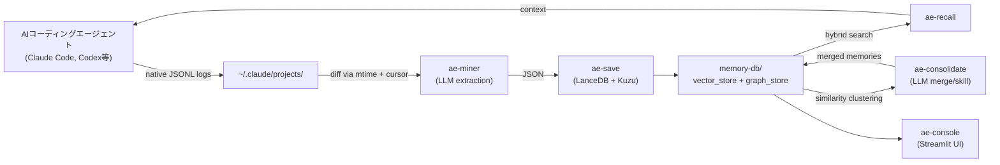

[English](./README.md)

# Agentic Engram

**AIコーディングエージェントのための自律型ローカルメモリエコシステム -- 人間の記憶の仕組みにインスパイアされた設計。**

Agentic Engramは、AIコーディングエージェント（Claude Code、Codex CLIなど）のネイティブセッションログを読み取り、LLMで再利用可能なナレッジを抽出し、ローカルのベクトル+グラフDBに保存する。エージェントはセマンティック検索で過去の教訓を呼び出せる -- クラウド不要、Docker不要、常駐サーバー不要。

## コンセプト



**ライフサイクル:**

1. **記録** -- AIコーディングエージェント（Claude Code等）は通常の動作の一部として構造化セッションログ（JSONL）を自動保存する。追加の記録設定は不要。
2. **採掘** -- `ae-miner`（cron）が`mtime`+行ポインタカーソルで変更ログを検出し、JSONLをパースして可読テキストに変換し、差分をLLMに送信。LLMがINSERT / UPDATE / SKIPを判定する。
3. **保存** -- `ae-save`が`sentence-transformers`でペイロードを埋め込みベクトル化し、LanceDBにupsertする。エンティティとリレーションはKuzuグラフDBに同期される。
4. **想起** -- `ae-recall`がハイブリッド検索（ベクトル類似度 + グラフトラバーサル）を実行。エージェントは未知のエラーに遭遇した際に自律的に呼び出す。
5. **統合** -- `ae-consolidate`がコサイン類似度で類似メモリをクラスタリングし、LLMで重複を統合。頻出パターン（出現回数 ≥ 3）は再利用可能なスキルファイルに昇格する。
6. **整理** -- `ae-groom`がカテゴリの正規化、エンティティ/リレーションのLLM再抽出、グラフDBの再構築、孤立エンティティの掃除を一括で行う。
7. **管理** -- `ae-console`がStreamlitダッシュボードを提供し、メモリの閲覧・検索・削除やエンティティグラフの探索ができる。

## 機能

- 完全ローカル、ゼロオーバーヘッド -- エージェントのネイティブログを読み取り、外部APIやサーバー不要
- Filebeatスタイルのクラッシュ耐性 -- `mtime`+行ポインタのみで状態管理、ステータスフラグなし
- 決定論的ID（SHA-256）による冪等upsert
- ハイブリッド検索：ベクトル類似度（LanceDB + `paraphrase-multilingual-MiniLM-L12-v2`）+ グラフトラバーサル（Kuzu）
- カテゴリ・タグフィルタリング
- Claude Code・Codex CLI用ネイティブJSONLパーサー（他CLIツールへの拡張可能）
- TTLベースの古いログの自動アーカイブ（テキストソースモード）
- エンティティグラフ可視化付きStreamlit管理コンソール

## クイックスタート

### 要件

- Python 3.9+
- セッションログを保存するAIコーディングエージェント（例：Claude Code）

### インストール

```bash
pip install -e ".[dev]"
```

### メモリの手動保存

```bash
echo '[{"action":"INSERT","payload":{"event":"CORS error with Ollama","context":"Direct fetch from Next.js client","core_lessons":"Use Route Handler as proxy","category":"architecture","tags":["Next.js","CORS"],"related_files":["app/api/chat/route.ts"],"session_id":"session_001"}}]' \
  | python scripts/ae-save.py
```

### メモリの検索

```bash
python scripts/ae-recall.py --query "CORS error" --format markdown
python scripts/ae-recall.py --query "CORS error" --format json --limit 3
```

### マイナーの実行

```bash
python scripts/ae-miner.py --dry-run                # 対象ログファイルをプレビュー（LLM不要）
python scripts/ae-miner.py --llm claude-code         # Claude Code JSONLログをマイニング（デフォルト）
python scripts/ae-miner.py --source codex --llm claude-code  # Codex CLI JONLログをマイニング
python scripts/ae-miner.py --llm codex               # Codex CLIをLLMバックエンドとして使用
python scripts/ae-miner.py --llm gemini              # Gemini CLIをLLMバックエンドとして使用
python scripts/ae-miner.py --source text --llm claude-code  # レガシー：生テキストログをマイニング
```

### コンソールの起動

```bash
streamlit run scripts/ae-console.py
```

## アーキテクチャ

```
~/.engram/
  memory-db/
    vector_store/        LanceDBデータ（セマンティック検索）
    graph_store/         Kuzuデータ（エンティティグラフ）
  config/
    cursor.json          ログファイルごとの行ポインタ + mtime
  skills/                ae-consolidateが生成するスキルファイル
```

| コンポーネント | ファイル | 役割 |
|-----------|------|------|
| `db` | `src/engram/db.py` | LanceDB接続、スキーマ、CRUD |
| `save` | `src/engram/save.py` | バリデーション、ID生成、upsertロジック、グラフ同期 |
| `recall` | `src/engram/recall.py` | ハイブリッド検索（ベクトル + グラフ）、出力フォーマット |
| `graph` | `src/engram/graph.py` | Kuzuグラフ DB: エンティティ/リレーションCRUD、トラバーサル |
| `miner` | `src/engram/miner.py` | ログスキャン、差分読み取り、LLMオーケストレーション |
| `parsers` | `src/engram/parsers/` | ネイティブログパーサー（Claude Code、Codex CLI） |
| `cursor` | `src/engram/cursor.py` | cursor.jsonのアトミックな状態管理 |
| `prompts` | `src/engram/prompts.py` | 抽出用LLMプロンプト構築 |
| `consolidate` | `src/engram/consolidate.py` | 類似度クラスタリング、統合・スキル化ロジック |
| `prompts_consolidate` | `src/engram/prompts_consolidate.py` | 統合用LLMプロンプト構築 |
| `embedder` | `src/engram/embedder.py` | sentence-transformersのシングルトンラッパー |
| `groom` | `src/engram/groom.py` | 一括メンテナンス：カテゴリ正規化、エンティティ再抽出、グラフ再構築 |
| `prompts_groom` | `src/engram/prompts_groom.py` | エンティティ再抽出用LLMプロンプト構築 |
| `console` | `src/engram/console.py` | Streamlit UIロジック（統計、閲覧、削除、グラフ） |

## CLIリファレンス

### ae-save

stdinからJSON配列を読み取り、バリデーション・埋め込み・LanceDBへのupsertを行う。

```
python scripts/ae-save.py [--db-path PATH] [--graph-path PATH]
```

### ae-recall

セマンティック類似度+グラフブーストでメモリを検索する。

```
python scripts/ae-recall.py --query "..." [--format json|markdown] [--limit N] [--category CAT]
                            [--graph-path PATH] [--no-graph]
```

### ae-miner

ネイティブセッションログをパースし、LLMでナレッジを抽出し、メモリDBに保存する。

```
python scripts/ae-miner.py --llm claude-code|codex|gemini
                           [--source claude-code|codex|text] [--log-dir DIR]
                           [--db-path PATH] [--cursor-path PATH] [--dry-run]
```

### ae-consolidate

コサイン類似度で類似メモリクラスタを検出し、LLMでMERGE（統合）、KEEP（維持）、SKILL（手順書に昇格）を判断する。

```
python scripts/ae-consolidate.py --llm claude-code|codex|gemini
                                  [--model MODEL] [--threshold 0.90]
                                  [--db-path PATH] [--graph-path PATH]
                                  [--skills-dir DIR] [--dry-run]
```

- `--dry-run`のみ（`--llm`なし）：検出されたクラスタをプレビュー（LLM不要）
- `--dry-run` + `--llm`：LLMの判断結果を表示するがDBは変更しない
- `--threshold`：クラスタリングのコサイン類似度閾値（デフォルト: 0.90）
- `--model`：LLMバックエンドに渡すモデル（例：`sonnet`）

### ae-groom

長期記憶の一括メンテナンス：カテゴリ正規化、エンティティ/リレーション再抽出、グラフDB再構築、孤立エンティティ掃除。

```
python scripts/ae-groom.py --llm claude-code|codex|gemini
                            [--model MODEL] [--batch-size N]
                            [--db-path PATH] [--graph-path PATH]
                            [--normalize-categories-only]
                            [--re-extract-only]
                            [--rebuild-graph-only]
                            [--dry-run]
```

- `--dry-run`：各フェーズの対象件数を表示するがDBは変更しない
- `--normalize-categories-only`：Phase 1のみ実行（LLM不要）
- `--re-extract-only`：Phase 2のみ実行（LLM必要）
- `--rebuild-graph-only`：Phase 3+4のみ実行（LLM不要）
- `--batch-size`：エンティティ再抽出の1回のLLM呼び出しで処理するメモリ件数（デフォルト: 5）
- `--model`：LLMバックエンドに渡すモデル（例：`sonnet`）

**フェーズ:**

1. **カテゴリ正規化** -- 分散したカテゴリを正規マッピングに従って統合（例：`troubleshooting` → `debugging`、`backend` → `implementation`）
2. **エンティティ/リレーション再抽出** -- 全メモリをLLMに送り、統一された品質でエンティティとリレーションを再抽出する
3. **グラフDB再構築** -- VectorDBをSingle Source of TruthとしてKuzuグラフDBを削除・再構築する
4. **孤立エンティティ掃除** -- `mention_count ≤ 0` のエンティティを削除する

### ae-console

メモリとグラフ管理用のStreamlit Webダッシュボード。

```
streamlit run scripts/ae-console.py
```

## AIエージェントとの連携

### 自律的な想起

#### CLAUDE.mdにae-recallをスキルとして登録する

プロジェクトの`CLAUDE.md`（またはグローバルアクセス用に`~/.claude/CLAUDE.md`）に以下を追加する：

```markdown
## Memory Recall
作業を始める前に、過去の経験が活かせないか確認すること：
- 新しい機能の実装を始める時（似た実装の経験がないか）
- 設計判断やアーキテクチャの選択を行う時（過去の判断根拠やトレードオフ）
- ライブラリやツールの使い方を検討する時（過去に得たコツや落とし穴）
- 未知のエラーや予期しない挙動に遭遇した時（過去に似た問題を解決していないか）
- 作業手順やワークフローに迷った時（効率的だった進め方）

以下を実行：
  python /path/to/agentic-engram/scripts/ae-recall.py --query "<作業内容や問題の説明>" --format markdown --limit 3
ゼロから考えるのではなく、まず過去の経験を参照すること。
```

エージェントはエラー発生時だけでなく、あらゆる作業の開始時にプロアクティブに`ae-recall`を呼び出す。人間が新しい作業を始める前に過去の経験を想起するのと同じように。

### マイナー -- AIコーディングエージェントCLIの利用

`ae-miner`はAIコーディングエージェントのネイティブセッションログ（JSONL）を読み取り、CLIツールをLLMバックエンドとして使用する。追加の記録設定やAPIキーは不要。

```bash
python scripts/ae-miner.py --llm claude-code   # ~/.claude/projects/を読み取り、`claude -p`を使用
python scripts/ae-miner.py --source codex --llm claude-code  # ~/.codex/sessions/を読み取り、`claude -p`を使用
python scripts/ae-miner.py --llm codex          # `codex exec`を使用
python scripts/ae-miner.py --llm gemini         # `gemini`を使用
```

#### PythonでカスタムLLMを渡す

CLIツールを使わずAPIを直接呼び出す場合は、`process_log()`にカスタム`llm_fn`コールバックを渡す：

```python
from engram.cursor import CursorManager
from engram.parsers.claude_code import ClaudeCodeParser
from engram.miner import process_log
import os

cm = CursorManager(os.path.expanduser("~/.engram/config/cursor.json"))
parser = ClaudeCodeParser()

from openai import OpenAI
client = OpenAI()

def llm_fn(messages: list[dict]) -> str:
    resp = client.chat.completions.create(model="gpt-4o", messages=messages, temperature=0.2)
    return resp.choices[0].message.content

for target in parser.scan(cm):
    process_log(target["filepath"], cm, llm_fn, db_path=os.path.expanduser("~/.engram/memory-db/vector_store"), parser=parser)
```

## 自動スケジューリング

> **macOS注意:** LLMバックエンド（例：`claude -p`）がmacOS Keychainで認証する場合、cronではなく**launchdを使用する必要がある**。cronジョブはユーザーログインセッション外で実行されるため、Keychainにアクセスできず認証エラーになる。LaunchAgentsはユーザーセッション内で実行されるため、Keychainに完全にアクセスできる。また、ログファイルへのリダイレクト時はPythonに`-u`フラグを付けてstdoutバッファリングを無効化すること。

### cron（Linux）

`ae-miner`を30分ごとに実行する：

```bash
crontab -e
```

```cron
*/30 * * * * cd /path/to/agentic-engram && .venv/bin/python scripts/ae-miner.py --llm claude-code >> ~/.engram/miner.log 2>&1
```

### launchd（macOS推奨）

`~/Library/LaunchAgents/com.engram.miner.plist`を作成する：

```xml
<?xml version="1.0" encoding="UTF-8"?>
<!DOCTYPE plist PUBLIC "-//Apple//DTD PLIST 1.0//EN"
  "http://www.apple.com/DTDs/PropertyList-1.0.dtd">
<plist version="1.0">
<dict>
  <key>Label</key>
  <string>com.engram.miner</string>
  <key>ProgramArguments</key>
  <array>
    <string>/path/to/agentic-engram/.venv/bin/python</string>
    <string>/path/to/agentic-engram/scripts/ae-miner.py</string>
    <string>--llm</string>
    <string>claude-code</string>
  </array>
  <key>StartInterval</key>
  <integer>1800</integer>
  <key>StandardOutPath</key>
  <string>/Users/YOU/.engram/miner.log</string>
  <key>StandardErrorPath</key>
  <string>/Users/YOU/.engram/miner.log</string>
</dict>
</plist>
```

読み込む：

```bash
launchctl load ~/Library/LaunchAgents/com.engram.miner.plist
```

### systemd timer（Linux）

Linuxサーバーでは、`~/.config/systemd/user/`配下にsystemdのservice + timerペアを作成する。構造はlaunchdと同様 -- `ae-miner.py`を実行するserviceユニットと、`OnUnitActiveSec=30min`を設定したtimerユニット。`systemctl --user enable --now engram-miner.timer`で有効化する。

## 開発

```bash
pip install -e ".[dev]"
pytest -v
```

## ロードマップ

- ~~**V2: グラフDB拡張**~~ -- **完了。** [Kuzu](https://kuzudb.com/)統合によるGraphRAGスタイルのハイブリッド検索（ベクトル類似度 + グラフトラバーサル）。
- ~~**V3: メモリ統合**~~ -- **完了。** コサイン類似度クラスタリング + LLM判断による類似メモリの自動重複排除・マージ。頻出パターン（出現回数 ≥ 3）は再利用可能なスキルファイルに昇格可能。

## ライセンス

[Apache License 2.0](LICENSE)
