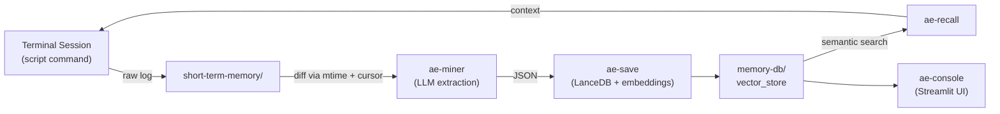

[日本語](./README.ja.md)

# Agentic Engram

**Autonomous local memory ecosystem for AI coding agents -- inspired by how human memory works.**

Agentic Engram captures raw development session logs, extracts reusable knowledge via LLM, and stores it in a local vector database. Agents can then recall past lessons by semantic search -- no cloud, no Docker, no running server.

## Concept



**Lifecycle:**

1. **Capture** -- `script` command streams terminal I/O into `~/.engram/short-term-memory/`.
2. **Mine** -- `ae-miner` (cron) detects changed logs via `mtime` + line-pointer cursor, sends diffs to an LLM, which decides INSERT / UPDATE / SKIP.
3. **Store** -- `ae-save` embeds payloads with `sentence-transformers` and upserts into LanceDB.
4. **Recall** -- `ae-recall` performs cosine-similarity search. Agents call it autonomously when they hit unknown errors.
5. **Manage** -- `ae-console` provides a Streamlit dashboard for browsing, searching, and deleting memories.

## Features

- Fully local, zero-overhead -- file-system based, no external APIs or servers required
- Filebeat-style crash resilience -- state tracked by `mtime` + line pointer only, no status flags
- Deterministic IDs (SHA-256) for idempotent upserts
- Semantic search via LanceDB + `paraphrase-multilingual-MiniLM-L12-v2` (384-dim)
- Category and tag filtering
- TTL-based auto-archiving of stale logs
- Streamlit management console
- Graph DB extension points (`entities_json`, `relations_json`) reserved for V2

## Quick Start

### Requirements

- Python 3.9+
- LLM provider (OpenAI, Anthropic, etc.): **not required** for `ae-save`, `ae-recall`, or `ae-console`. `ae-miner` is designed to use an LLM for log extraction, but CLI-level integration is not yet implemented.

### Install

```bash
pip install -e ".[dev]"
```

### Record a session

```bash
script -q -a ~/.engram/short-term-memory/session_$(date +%Y%m%d_%H%M%S)_log.txt
```

### Save a memory manually

```bash
echo '[{"action":"INSERT","payload":{"event":"CORS error with Ollama","context":"Direct fetch from Next.js client","core_lessons":"Use Route Handler as proxy","category":"architecture","tags":["Next.js","CORS"],"related_files":["app/api/chat/route.ts"],"session_id":"session_001"}}]' \
  | python scripts/ae-save.py
```

### Search memories

```bash
python scripts/ae-recall.py --query "CORS error" --format markdown
python scripts/ae-recall.py --query "CORS error" --format json --limit 3
```

### Run the miner

```bash
python scripts/ae-miner.py --dry-run                # preview target log files (no LLM required)
python scripts/ae-miner.py --llm claude-code         # use Claude Code as LLM backend
python scripts/ae-miner.py --llm codex               # use Codex CLI
python scripts/ae-miner.py --llm gemini              # use Gemini CLI
```

### Launch the console

```bash
streamlit run scripts/ae-console.py
```

## Architecture

```
~/.engram/
  short-term-memory/     Raw session logs (short-term memory)
    archive/             TTL-expired logs
  memory-db/
    vector_store/        LanceDB data (semantic search)
    graph_store/         [V2] Kuzu data (logical network)
  config/
    cursor.json          Line pointer + mtime per log file
```

| Component | File | Role |
|-----------|------|------|
| `db` | `src/engram/db.py` | LanceDB connection, schema, CRUD |
| `save` | `src/engram/save.py` | Validation, ID generation, upsert logic |
| `recall` | `src/engram/recall.py` | Semantic search, output formatting |
| `miner` | `src/engram/miner.py` | Log scanning, diff reading, LLM orchestration, archiving |
| `cursor` | `src/engram/cursor.py` | Atomic cursor.json state management |
| `prompts` | `src/engram/prompts.py` | LLM prompt construction for extraction |
| `embedder` | `src/engram/embedder.py` | Sentence-transformers singleton wrapper |
| `console` | `src/engram/console.py` | Streamlit UI logic (stats, browse, delete) |

## CLI Reference

### ae-save

Reads a JSON array from stdin, validates, embeds, and upserts into LanceDB.

```
python scripts/ae-save.py [--db-path PATH]
```

### ae-recall

Searches memories by semantic similarity.

```
python scripts/ae-recall.py --query "..." [--format json|markdown] [--limit N] [--category CAT]
```

### ae-miner

Scans session logs, extracts knowledge via LLM, saves to memory DB.

```
python scripts/ae-miner.py --llm claude-code|codex|gemini
                           [--log-dir DIR] [--db-path PATH] [--cursor-path PATH]
                           [--archive-dir DIR] [--ttl-days N] [--dry-run]
```

### ae-console

Streamlit web dashboard for memory management.

```
streamlit run scripts/ae-console.py
```

## Integration with AI Agents

### Agent 1 (Development Agent) -- Autonomous Recall

#### Registering ae-recall as a Skill in CLAUDE.md

Add the following to your project's `CLAUDE.md` (or `~/.claude/CLAUDE.md` for global access):

```markdown
# Skills

## Memory Recall
When you encounter an unfamiliar error, unexpected behavior, or need to check
if a similar problem was solved before, run:
  python /path/to/agentic-engram/scripts/ae-recall.py --query "<describe the issue>" --format markdown --limit 3
Review the results before attempting a fix from scratch.
```

The agent will then autonomously invoke `ae-recall` when it hits unknown errors, retrieving past lessons before trying to solve problems from scratch.

#### Auto-recording development sessions

Add a shell alias so every `claude` session is transparently recorded:

```bash
# ~/.bashrc or ~/.zshrc
alias ae-claude='script -q -a ~/.engram/short-term-memory/session_$(date +%Y%m%d_%H%M%S)_log.txt -c "claude"'
```

Then simply run `ae-claude` instead of `claude`. All terminal I/O is streamed into `short-term-memory/` with zero overhead.

### Agent 2 (Miner) -- Using AI CLI Tools

`ae-miner` uses AI coding agent CLIs (Claude Code, Codex CLI, Gemini CLI) as the LLM backend for knowledge extraction. No API keys need to be configured separately -- it delegates to whichever CLI tool you already have authenticated.

```bash
python scripts/ae-miner.py --llm claude-code   # uses `claude -p`
python scripts/ae-miner.py --llm codex          # uses `codex -q`
python scripts/ae-miner.py --llm gemini         # uses `gemini`
```

#### Custom LLM via Python

For direct API integration (without a CLI tool), pass a custom `llm_fn` callback to `process_log()`:

```python
from engram.cursor import CursorManager
from engram.miner import scan_logs, process_log
import os

cm = CursorManager(os.path.expanduser("~/.engram/config/cursor.json"))

# -- OpenAI example --
from openai import OpenAI
client = OpenAI()

def llm_fn(messages: list[dict]) -> str:
    resp = client.chat.completions.create(model="gpt-4o", messages=messages, temperature=0.2)
    return resp.choices[0].message.content

for target in scan_logs(os.path.expanduser("~/.engram/short-term-memory"), cm):
    process_log(target["filepath"], cm, llm_fn, db_path=os.path.expanduser("~/.engram/memory-db/vector_store"))
```

## Automated Scheduling

### cron (Linux / macOS)

Run `ae-miner` every 30 minutes:

```bash
crontab -e
```

```cron
*/30 * * * * cd /path/to/agentic-engram && .venv/bin/python scripts/ae-miner.py --llm claude-code >> ~/.engram/miner.log 2>&1
```

### launchd (macOS native)

Create `~/Library/LaunchAgents/com.engram.miner.plist`:

```xml
<?xml version="1.0" encoding="UTF-8"?>
<!DOCTYPE plist PUBLIC "-//Apple//DTD PLIST 1.0//EN"
  "http://www.apple.com/DTDs/PropertyList-1.0.dtd">
<plist version="1.0">
<dict>
  <key>Label</key>
  <string>com.engram.miner</string>
  <key>ProgramArguments</key>
  <array>
    <string>/path/to/agentic-engram/.venv/bin/python</string>
    <string>/path/to/agentic-engram/scripts/ae-miner.py</string>
    <string>--llm</string>
    <string>claude-code</string>
  </array>
  <key>StartInterval</key>
  <integer>1800</integer>
  <key>StandardOutPath</key>
  <string>/Users/YOU/.engram/miner.log</string>
  <key>StandardErrorPath</key>
  <string>/Users/YOU/.engram/miner.log</string>
</dict>
</plist>
```

Load it:

```bash
launchctl load ~/Library/LaunchAgents/com.engram.miner.plist
```

### systemd timer (Linux)

For Linux servers, create a systemd service + timer pair under `~/.config/systemd/user/`. The structure mirrors the launchd approach -- a service unit that runs `ae-miner.py` and a timer unit with `OnUnitActiveSec=30min`. Enable with `systemctl --user enable --now engram-miner.timer`.

## Development

```bash
pip install -e ".[dev]"
pytest -v
```

## Roadmap

- **V2: Graph DB extension** -- Integrate [Kuzu](https://kuzudb.com/) to materialize `entities_json` / `relations_json` into a property graph, enabling GraphRAG-style hybrid retrieval (vector similarity + logical traversal).

## License

[Apache License 2.0](LICENSE)
