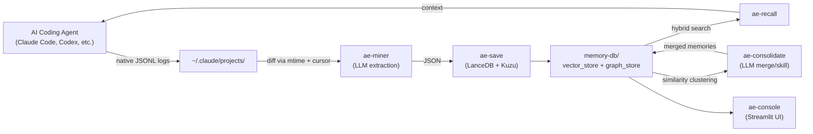

[日本語](./README.ja.md)

# Agentic Engram

**Autonomous local memory ecosystem for AI coding agents -- inspired by how human memory works.**

Agentic Engram reads native session logs from AI coding agents (Claude Code, Codex CLI, etc.), extracts reusable knowledge via LLM, and stores it in a local vector + graph database. Agents can then recall past lessons by semantic search -- no cloud, no Docker, no running server.

## Concept



**Lifecycle:**

1. **Capture** -- AI coding agents (Claude Code, etc.) automatically save structured session logs (JSONL) as part of their normal operation. No additional recording setup needed.
2. **Mine** -- `ae-miner` (cron) detects changed logs via `mtime` + line-pointer cursor, parses JSONL into readable text, sends diffs to an LLM, which decides INSERT / UPDATE / SKIP.
3. **Store** -- `ae-save` embeds payloads with `sentence-transformers` and upserts into LanceDB. Entities and relations are synced to Kuzu graph DB.
4. **Recall** -- `ae-recall` performs hybrid search (vector similarity + graph traversal). Agents call it autonomously when they hit unknown errors.
5. **Consolidate** -- `ae-consolidate` clusters similar memories by cosine similarity and uses LLM to merge duplicates or promote recurring patterns (occurrence count ≥ 3) to reusable skill files.
6. **Manage** -- `ae-console` provides a Streamlit dashboard for browsing, searching, deleting memories and exploring the entity graph.

## Features

- Fully local, zero-overhead -- reads native agent logs, no external APIs or servers required
- Filebeat-style crash resilience -- state tracked by `mtime` + line pointer only, no status flags
- Deterministic IDs (SHA-256) for idempotent upserts
- Hybrid search: vector similarity (LanceDB + `paraphrase-multilingual-MiniLM-L12-v2`) + graph traversal (Kuzu)
- Category and tag filtering
- Native JSONL parsers for Claude Code and Codex CLI (extensible to other CLI tools)
- TTL-based auto-archiving of stale logs (text source mode)
- Streamlit management console with entity graph visualization

## Quick Start

### Requirements

- Python 3.9+
- An AI coding agent that saves session logs (e.g., Claude Code)

### Install

```bash
pip install -e ".[dev]"
```

### Save a memory manually

```bash
echo '[{"action":"INSERT","payload":{"event":"CORS error with Ollama","context":"Direct fetch from Next.js client","core_lessons":"Use Route Handler as proxy","category":"architecture","tags":["Next.js","CORS"],"related_files":["app/api/chat/route.ts"],"session_id":"session_001"}}]' \
  | python scripts/ae-save.py
```

### Search memories

```bash
python scripts/ae-recall.py --query "CORS error" --format markdown
python scripts/ae-recall.py --query "CORS error" --format json --limit 3
```

### Run the miner

```bash
python scripts/ae-miner.py --dry-run                # preview target log files (no LLM required)
python scripts/ae-miner.py --llm claude-code         # mine Claude Code JSONL logs (default)
python scripts/ae-miner.py --source codex --llm claude-code  # mine Codex CLI JSONL logs
python scripts/ae-miner.py --llm codex               # use Codex CLI as LLM backend
python scripts/ae-miner.py --llm gemini              # use Gemini CLI as LLM backend
python scripts/ae-miner.py --source text --llm claude-code  # legacy: mine raw text logs
```

### Launch the console

```bash
streamlit run scripts/ae-console.py
```

## Architecture

```
~/.engram/
  memory-db/
    vector_store/        LanceDB data (semantic search)
    graph_store/         Kuzu data (entity graph)
  config/
    cursor.json          Line pointer + mtime per log file
  skills/                Skill files generated by ae-consolidate
```

| Component | File | Role |
|-----------|------|------|
| `db` | `src/engram/db.py` | LanceDB connection, schema, CRUD |
| `save` | `src/engram/save.py` | Validation, ID generation, upsert logic, graph sync |
| `recall` | `src/engram/recall.py` | Hybrid search (vector + graph), output formatting |
| `graph` | `src/engram/graph.py` | Kuzu graph DB: entity/relation CRUD, traversal |
| `miner` | `src/engram/miner.py` | Log scanning, diff reading, LLM orchestration |
| `parsers` | `src/engram/parsers/` | Native log parsers (Claude Code, Codex CLI) |
| `cursor` | `src/engram/cursor.py` | Atomic cursor.json state management |
| `prompts` | `src/engram/prompts.py` | LLM prompt construction for extraction |
| `consolidate` | `src/engram/consolidate.py` | Similarity clustering, merge/skill logic |
| `prompts_consolidate` | `src/engram/prompts_consolidate.py` | LLM prompt construction for consolidation |
| `embedder` | `src/engram/embedder.py` | Sentence-transformers singleton wrapper |
| `console` | `src/engram/console.py` | Streamlit UI logic (stats, browse, delete, graph) |

## CLI Reference

### ae-save

Reads a JSON array from stdin, validates, embeds, and upserts into LanceDB.

```
python scripts/ae-save.py [--db-path PATH] [--graph-path PATH]
```

### ae-recall

Searches memories by semantic similarity with optional graph boost.

```
python scripts/ae-recall.py --query "..." [--format json|markdown] [--limit N] [--category CAT]
                            [--graph-path PATH] [--no-graph]
```

### ae-miner

Parses native session logs, extracts knowledge via LLM, saves to memory DB.

```
python scripts/ae-miner.py --llm claude-code|codex|gemini
                           [--source claude-code|codex|text] [--log-dir DIR]
                           [--db-path PATH] [--cursor-path PATH] [--dry-run]
```

### ae-consolidate

Detects similar memory clusters via cosine similarity and uses LLM to decide MERGE, KEEP, or SKILL (promote to reusable procedure).

```
python scripts/ae-consolidate.py --llm claude-code|codex|gemini
                                  [--model MODEL] [--threshold 0.90]
                                  [--db-path PATH] [--graph-path PATH]
                                  [--skills-dir DIR] [--dry-run]
```

- `--dry-run` without `--llm`: preview detected clusters (no LLM required)
- `--dry-run` with `--llm`: show LLM decisions without modifying the DB
- `--threshold`: cosine similarity threshold for clustering (default: 0.90)
- `--model`: model to pass to the LLM backend (e.g. `sonnet`)

### ae-console

Streamlit web dashboard for memory and graph management.

```
streamlit run scripts/ae-console.py
```

## Integration with AI Agents

### Autonomous Recall

#### Registering ae-recall as a Skill in CLAUDE.md

Add the following to your project's `CLAUDE.md` (or `~/.claude/CLAUDE.md` for global access):

```markdown
## Memory Recall
When you encounter an unfamiliar error, unexpected behavior, or need to check
if a similar problem was solved before, run:
  python /path/to/agentic-engram/scripts/ae-recall.py --query "<describe the issue>" --format markdown --limit 3
Review the results before attempting a fix from scratch.
```

The agent will then autonomously invoke `ae-recall` when it hits unknown errors, retrieving past lessons before trying to solve problems from scratch.

### Miner -- Using AI CLI Tools

`ae-miner` reads native session logs (JSONL) from AI coding agents and uses CLI tools as the LLM backend for knowledge extraction. No additional recording setup or API keys needed.

```bash
python scripts/ae-miner.py --llm claude-code   # reads ~/.claude/projects/, uses `claude -p`
python scripts/ae-miner.py --source codex --llm claude-code  # reads ~/.codex/sessions/, uses `claude -p`
python scripts/ae-miner.py --llm codex          # uses `codex exec`
python scripts/ae-miner.py --llm gemini         # uses `gemini`
```

#### Custom LLM via Python

For direct API integration (without a CLI tool), pass a custom `llm_fn` callback to `process_log()`:

```python
from engram.cursor import CursorManager
from engram.parsers.claude_code import ClaudeCodeParser
from engram.miner import process_log
import os

cm = CursorManager(os.path.expanduser("~/.engram/config/cursor.json"))
parser = ClaudeCodeParser()

from openai import OpenAI
client = OpenAI()

def llm_fn(messages: list[dict]) -> str:
    resp = client.chat.completions.create(model="gpt-4o", messages=messages, temperature=0.2)
    return resp.choices[0].message.content

for target in parser.scan(cm):
    process_log(target["filepath"], cm, llm_fn, db_path=os.path.expanduser("~/.engram/memory-db/vector_store"), parser=parser)
```

## Automated Scheduling

> **macOS note:** If your LLM backend (e.g. `claude -p`) uses macOS Keychain for authentication, you **must** use launchd instead of cron. Cron jobs run outside the user login session and cannot access Keychain credentials, resulting in authentication errors. LaunchAgents run within the user session and have full Keychain access. Also add the `-u` flag to Python to disable stdout buffering when output is redirected to a log file.

### cron (Linux)

Run `ae-miner` every 30 minutes:

```bash
crontab -e
```

```cron
*/30 * * * * cd /path/to/agentic-engram && .venv/bin/python scripts/ae-miner.py --llm claude-code >> ~/.engram/miner.log 2>&1
```

### launchd (macOS recommended)

Create `~/Library/LaunchAgents/com.engram.miner.plist`:

```xml
<?xml version="1.0" encoding="UTF-8"?>
<!DOCTYPE plist PUBLIC "-//Apple//DTD PLIST 1.0//EN"
  "http://www.apple.com/DTDs/PropertyList-1.0.dtd">
<plist version="1.0">
<dict>
  <key>Label</key>
  <string>com.engram.miner</string>
  <key>ProgramArguments</key>
  <array>
    <string>/path/to/agentic-engram/.venv/bin/python</string>
    <string>/path/to/agentic-engram/scripts/ae-miner.py</string>
    <string>--llm</string>
    <string>claude-code</string>
  </array>
  <key>StartInterval</key>
  <integer>1800</integer>
  <key>StandardOutPath</key>
  <string>/Users/YOU/.engram/miner.log</string>
  <key>StandardErrorPath</key>
  <string>/Users/YOU/.engram/miner.log</string>
</dict>
</plist>
```

Load it:

```bash
launchctl load ~/Library/LaunchAgents/com.engram.miner.plist
```

### systemd timer (Linux)

For Linux servers, create a systemd service + timer pair under `~/.config/systemd/user/`. The structure mirrors the launchd approach -- a service unit that runs `ae-miner.py` and a timer unit with `OnUnitActiveSec=30min`. Enable with `systemctl --user enable --now engram-miner.timer`.

## Development

```bash
pip install -e ".[dev]"
pytest -v
```

## Roadmap

- ~~**V2: Graph DB extension**~~ -- **Done.** [Kuzu](https://kuzudb.com/) integration for GraphRAG-style hybrid retrieval (vector similarity + graph traversal).
- ~~**V3: Memory consolidation**~~ -- **Done.** Automatic deduplication and merging of similar memories via cosine similarity clustering + LLM judgment. Recurring patterns (occurrence count ≥ 3) can be promoted to reusable skill files.

## License

[Apache License 2.0](LICENSE)
